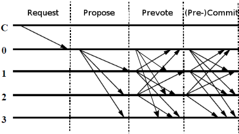

Here I try to make the same analysis described [here](https://eprints.soton.ac.uk/415083/2/itasec18_main.pdf) on Tendermint/Ethermint, i.e.:

1. Classify the Tendermint consensus algorithm according to CAP theorem
2. Performance Analysis
3. Feasible attacks and protocol vulnerabilities;
4. DoS client

## 1) Tendermint and the CAP theorem

Now we briefly sumarize what the CAP properties (namely, Consistency, Availability and Partition Tolerance) mean in blockchain applications:

- _Consistency_: A blockchain achieves consistency when forks are avoided.
- _Availability_:A blockchain is available if transactions submitted by clients are served and even-
tually committed, i.e.  permanently added to the chain.
- _Partition Tolerance_: When a network partition occurs,  Tendermint validators are divided into disjoint groups in such a way that nodes in different groups cannot communicate each other.

Since a blockchain must tolerate partitions, hence CA option is not considered, we
analyse the algorithms with respect to CP and AP options. 

### Tendermint: Consistent or Available?
As stated in [1]:
> A block is considered committed when a 2/3 majority of validators sign commit votes for that block. A fork occurs when two blocks at the same height are each signed by a 2/3 majority of validators. By simple arithmetic, a fork can only happen when at least a 1/3 majority of validators signs duplicitously. 
>
Hence, as long as there exists a majority of validators (in terms of their voting power), no forks can happen.

Moreover, as stated in [2] (3.2 Consensus):
> After the proposal,  rounds proceed in a fully asynchronous manner - a
validator makes progress only after hearing from at least two-thirds of the
other validators.  This relieves any sort of dependence on synchronized clocks
or  bounded  network  delays,  but  implies  that  the  network  will  halt  if  one-
third or more of the validators become unresponsive
>
Hence, consistency is preserved while availability is given up. Tendermint can be classified as CP system, according to the CAP theorem.

Summarizing the message passing schema:

[Here](demo-consensus.md) you can find description of logs of a Tendermint network to prove the depitched behavior.

### Tendermint consensus algorithm
Here some more information about the Tendermint consensus algorithm.
 
[paper on Tendermint](https://tendermint.com/static/docs/tendermint.pdf)
- Description of the working assumptions for the consensus algorithm, in the light of [FLP impossbiility](https://groups.csail.mit.edu/tds/papers/Lynch/jacm85.pdf)
> - Partial-synchrony
> - all non-byzantine nodes have access to an internal clock that can stay sufficiently accurate for a short duration of time until consensus on the next block is achieved
>

#### Consensus Phases
There are 3 phases + 2 special phases (Commit and NewHeight):

- Propose
- Prevote
- Precommit
- Commit
- NewHeight

A _Round_ is:
> (Propose -> Prevote -> Precommit)

Optimal scenario:
> NewHeight -> (Propose -> Prevote -> Precommit)+ -> Commit

some references:
[2] (4.2.2 Votes), in which says that:
> ... after the proposal, a node is
waiting for votes (or a local timeout) to progress.

## 2) Performance analysis

### How to
The following instructions require `tsung` to be installed.
- [Official website](http://tsung.erlang-projects.org/)
- [useful post on Tsung](https://engineering.helpshift.com/2014/tsung/)

In one terminal, run:

    python3 ethermint-dos.py 4 --dummy
    
In another terminal, run:

    tsung -f bench/dummy/dummy.xml start

It prompts you a `ssh-askpass`. The session is associated to a log directory number (something like `20180202-2241`)

If you want to see progresses, run:

     tail -f $HOME.tsung/log/LOG_DIRECTORY/tsung.log 

where `$LOG_DIRECTORY` is the number shown before.

Once the execution ends, type:

    rm output -Rf
    mkdir output && cd output
    /usr/lib/tsung/bin/tsung_stats.pl --stats $HOME/.tsung/log/$LOG_DIRECTORY/tsung.log
    firefox graph.html
    
Replace `firefox` with your favorite browser.
    
### Results

You can execute the load test by yourself, or see the result of a test that I've executed, saved in `res/bench-dummy-results`.

For example, you can execute:

    cd res/bench-dummy-results/graphs
    find . ! -name '*_tn.png'  | xargs firefox
    
    cd ../
    firefox ./evil/graph.html ./normal/graph.html

## 3) Feasible attacks and protocol vulnerabilities;
TODO

## 4) DoS client

Please refer to this [demo](demo-dos.md) for the details.

## References
- [[1] Tendermint: Consensus without Mining](https://tendermint.com/static/docs/tendermint.pdf)
- [[2] Tendermint:  Byzantine Fault Tolerance in the Age of Blockchains](https://tendermint.com/static/docs/tendermint.pdf)

